# Схема базы данных

Все приложения используют одну PostgreSQL-базу `petstore`. Данные разделены между четырьмя
схемами по владельцам: `catalog`, `inventory`, `customer` и `orders`. `api-gateway` собственной
схемы и таблиц не имеет.

```plantuml
@startuml
title PostgreSQL petstore — схема данных приложений

left to right direction
skinparam shadowing false
skinparam linetype polyline
skinparam nodesep 60
skinparam ranksep 90
skinparam ArrowFontSize 10
skinparam packageStyle rectangle

package "PostgreSQL: petstore" as petstore {

  package "schema catalog\ncatalog-service" as catalog_schema {

    entity "category" as catalog_category {
      * id : BIGINT <<PK, identity>>
      --
      * code : TEXT <<UQ>>
      * name : TEXT
    }

    entity "species" as catalog_species {
      * id : BIGINT <<PK, identity>>
      --
      * code : TEXT <<UQ>>
      * name : TEXT
    }

    entity "brand" as catalog_brand {
      * id : BIGINT <<PK, identity>>
      --
      * code : TEXT <<UQ>>
      * name : TEXT
    }

    entity "product" as catalog_product {
      * id : UUID <<PK>>
      --
      * sku : TEXT <<UQ>>
      * name : TEXT
        description : TEXT
      * price : DECIMAL(12,2)
      * active : BOOLEAN = true
      * category_id : BIGINT <<FK>>
      * species_id : BIGINT <<FK>>
      * brand_id : BIGINT <<FK>>
      * created_at : TIMESTAMPTZ
      * updated_at : TIMESTAMPTZ
    }
  }

  package "schema customer\ncustomer-service" as customer_schema {

    entity "city" as customer_city {
      * id : BIGINT <<PK, identity>>
      --
      * code : TEXT <<UQ>>
      * name : TEXT
    }

    entity "customer_status" as customer_status {
      * id : BIGINT <<PK, identity>>
      --
      * code : TEXT <<UQ>>
      * name : TEXT
    }

    entity "customer" as customer_customer {
      * id : UUID <<PK>>
      --
      * email : TEXT <<UQ>>
        phone : TEXT
      * first_name : TEXT
      * last_name : TEXT
      * status_id : BIGINT <<FK>>
      * created_at : TIMESTAMPTZ
      * updated_at : TIMESTAMPTZ
    }

    entity "address" as customer_address {
      * id : UUID <<PK>>
      --
      * customer_id : UUID <<FK>>
      * city_id : BIGINT <<FK>>
      * street : TEXT
      * building : TEXT
        apartment : TEXT
        postal_code : TEXT
      * is_default : BOOLEAN = false
      * created_at : TIMESTAMPTZ
      * updated_at : TIMESTAMPTZ
      --
      UQ_default : customer_id WHERE is_default
    }
  }

  package "schema inventory\ninventory-service" as inventory_schema {

    entity "warehouse" as inventory_warehouse {
      * id : BIGINT <<PK, identity>>
      --
      * code : TEXT <<UQ>>
      * name : TEXT
    }

    entity "reservation_status" as inventory_reservation_status {
      * id : BIGINT <<PK, identity>>
      --
      * code : TEXT <<UQ>>
      * name : TEXT
    }

    entity "stock_item" as inventory_stock_item {
      * id : UUID <<PK>>
      --
      * product_id : UUID <<UQ, REF>>
      * warehouse_id : BIGINT <<FK>>
      * quantity : INT
      * reserved : INT = 0
      * version : BIGINT = 0
      * created_at : TIMESTAMPTZ
      * updated_at : TIMESTAMPTZ
      --
      CHECK_quantity : quantity >= 0
      CHECK_reserved : 0 <= reserved <= quantity
    }

    entity "reservation" as inventory_reservation {
      * id : UUID <<PK>>
      --
      * order_id : UUID <<UQ, REF>>
      * status_id : BIGINT <<FK>>
      * expires_at : TIMESTAMPTZ
      * created_at : TIMESTAMPTZ
      * updated_at : TIMESTAMPTZ
    }

    entity "reservation_item" as inventory_reservation_item {
      * id : UUID <<PK>>
      --
      * reservation_id : UUID <<FK>>
      * product_id : UUID <<REF>>
      * quantity : INT
      --
      UQ_product : reservation_id + product_id
      CHECK_quantity : quantity > 0
    }

    entity "shedlock" as inventory_shedlock {
      * name : VARCHAR(64) <<PK>>
      --
      * lock_until : TIMESTAMP
      * locked_at : TIMESTAMP
      * locked_by : VARCHAR(255)
    }
  }

  package "schema orders\norder-service" as orders_schema {

    entity "order_status" as orders_order_status {
      * id : BIGINT <<PK, identity>>
      --
      * code : TEXT <<UQ>>
      * name : TEXT
    }

    entity "delivery_type" as orders_delivery_type {
      * id : BIGINT <<PK, identity>>
      --
      * code : TEXT <<UQ>>
      * name : TEXT
    }

    entity "payment_method" as orders_payment_method {
      * id : BIGINT <<PK, identity>>
      --
      * code : TEXT <<UQ>>
      * name : TEXT
    }

    entity "customer_order" as orders_customer_order {
      * id : UUID <<PK>>
      --
      * customer_id : UUID <<REF>>
      * customer_email : TEXT
        idempotency_key : TEXT
      * status_id : BIGINT <<FK>>
      * delivery_type_id : BIGINT <<FK>>
      * payment_method_id : BIGINT <<FK>>
      * total_amount : NUMERIC(12,2)
      * address_city_code : TEXT
      * address_city_name : TEXT
      * address_street : TEXT
      * address_building : TEXT
        address_apartment : TEXT
        address_postal_code : TEXT
      * version : BIGINT = 0
      * created_at : TIMESTAMPTZ
      * updated_at : TIMESTAMPTZ
      --
      UQ_idempotency : customer_id + idempotency_key
      CHECK_total : total_amount >= 0
    }

    entity "order_item" as orders_order_item {
      * id : UUID <<PK>>
      --
      * order_id : UUID <<FK>>
      * product_id : UUID <<REF>>
      * product_name : TEXT
      * unit_price : NUMERIC(12,2)
      * quantity : INT
      --
      UQ_product : order_id + product_id
      CHECK_price : unit_price >= 0
      CHECK_quantity : quantity > 0
    }

    entity "order_status_history" as orders_status_history {
      * id : UUID <<PK>>
      --
      * order_id : UUID <<FK>>
      * status_id : BIGINT <<FK>>
      * changed_at : TIMESTAMPTZ
    }

    entity "outbox_message" as orders_outbox_message {
      * id : UUID <<PK>>
      --
      * aggregate_id : UUID <<REF>>
      * topic : TEXT
      * type : TEXT
      * payload : TEXT
        request_id : TEXT
      * attempts : INT = 0
      * created_at : TIMESTAMPTZ
        published_at : TIMESTAMPTZ
    }

    entity "shedlock" as orders_shedlock {
      * name : VARCHAR(64) <<PK>>
      --
      * lock_until : TIMESTAMP
      * locked_at : TIMESTAMP
      * locked_by : VARCHAR(255)
    }
  }
}

' Physical foreign keys inside service-owned schemas.
catalog_category ||--o{ catalog_product : category_id
catalog_species ||--o{ catalog_product : species_id
catalog_brand ||--o{ catalog_product : brand_id

customer_status ||--o{ customer_customer : status_id
customer_customer ||--o{ customer_address : customer_id\nON DELETE CASCADE
customer_city ||--o{ customer_address : city_id

inventory_warehouse ||--o{ inventory_stock_item : warehouse_id
inventory_reservation_status ||--o{ inventory_reservation : status_id
inventory_reservation ||--o{ inventory_reservation_item : reservation_id\nON DELETE CASCADE

orders_order_status ||--o{ orders_customer_order : status_id
orders_delivery_type ||--o{ orders_customer_order : delivery_type_id
orders_payment_method ||--o{ orders_customer_order : payment_method_id
orders_customer_order ||--o{ orders_order_item : order_id\nON DELETE CASCADE
orders_customer_order ||--o{ orders_status_history : order_id\nON DELETE CASCADE
orders_order_status ||--o{ orders_status_history : status_id

' Logical references interpreted by application code rather than enforced by database FKs.
inventory_stock_item ..> catalog_product : product_id
inventory_reservation_item ..> inventory_stock_item : product_id
inventory_reservation ..> orders_customer_order : order_id
orders_customer_order ..> customer_customer : customer_id
orders_order_item ..> catalog_product : product_id
orders_outbox_message ..> orders_customer_order : aggregate_id

legend right
  |= Обозначение |= Значение |
  | <<PK>> | Primary key |
  | <<FK>> | Физический foreign key |
  | <<UQ>> | Уникальное значение или ограничение |
  | <<REF>> | Логическая ссылка без foreign key |
  | * поле | NOT NULL |
  | поле без * | Допускает NULL |
  | Сплошная линия | Физическая связь в PostgreSQL |
  | Пунктирная стрелка | Логическая связь без foreign key |
endlegend

@enduml
```

