# Диаграммы основных use case

Диаграммы описывают фактические сценарии текущей реализации. Покупатель, оператор и система оплаты
здесь являются логическими участниками: аутентификации, авторизации и формальных ролей в проекте нет.
Сквозные фильтры логирования, метрик и защиты от перегрузки не показаны, чтобы оставить в диаграммах
бизнес-поток.

## Просмотр и фильтрация каталога

Покупатель может получить страницу товаров с фильтрами по категории, виду животного, бренду и
признаку активности, а затем открыть карточку конкретного товара.

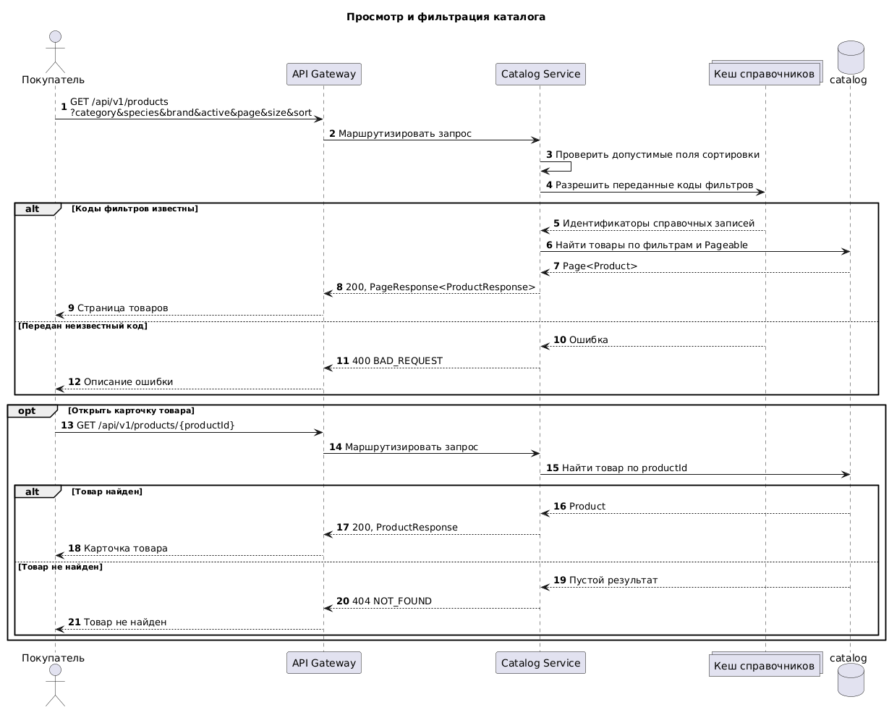

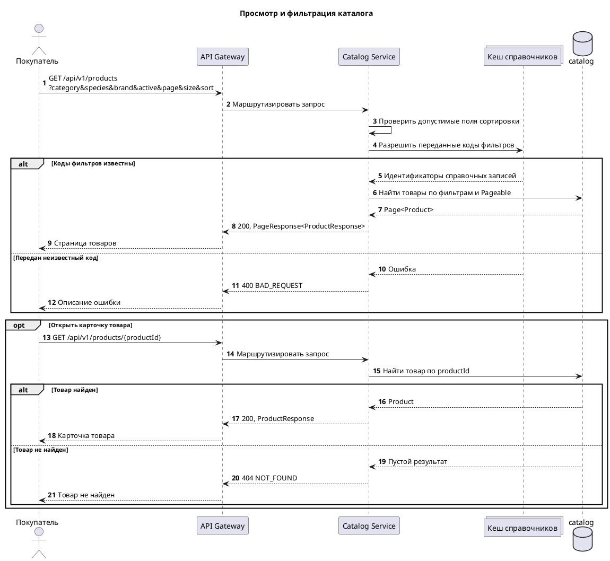
```plantuml
@startuml
title Просмотр и фильтрация каталога
autonumber

actor "Покупатель" as Buyer
participant "API Gateway" as Gateway
participant "Catalog Service" as Catalog
collections "Кеш справочников" as References
database "catalog" as CatalogDb

Buyer -> Gateway: GET /api/v1/products\n?category&species&brand&active&page&size&sort
Gateway -> Catalog: Маршрутизировать запрос
Catalog -> Catalog: Проверить допустимые поля сортировки
Catalog -> References: Разрешить переданные коды фильтров

alt Коды фильтров известны
    References --> Catalog: Идентификаторы справочных записей
    Catalog -> CatalogDb: Найти товары по фильтрам и Pageable
    CatalogDb --> Catalog: Page<Product>
    Catalog --> Gateway: 200, PageResponse<ProductResponse>
    Gateway --> Buyer: Страница товаров
else Передан неизвестный код
    References --> Catalog: Ошибка
    Catalog --> Gateway: 400 BAD_REQUEST
    Gateway --> Buyer: Описание ошибки
end

opt Открыть карточку товара
    Buyer -> Gateway: GET /api/v1/products/{productId}
    Gateway -> Catalog: Маршрутизировать запрос
    Catalog -> CatalogDb: Найти товар по productId
    alt Товар найден
        CatalogDb --> Catalog: Product
        Catalog --> Gateway: 200, ProductResponse
        Gateway --> Buyer: Карточка товара
    else Товар не найден
        CatalogDb --> Catalog: Пустой результат
        Catalog --> Gateway: 404 NOT_FOUND
        Gateway --> Buyer: Товар не найден
    end
end
@enduml
```

## Управление профилем клиента

Сценарий объединяет регистрацию, поиск, просмотр, полную замену и удаление клиента. При создании
статус по умолчанию — `NEW`; email нормализуется и должен быть уникальным. Удаление клиента удаляет
и принадлежащие ему адреса.

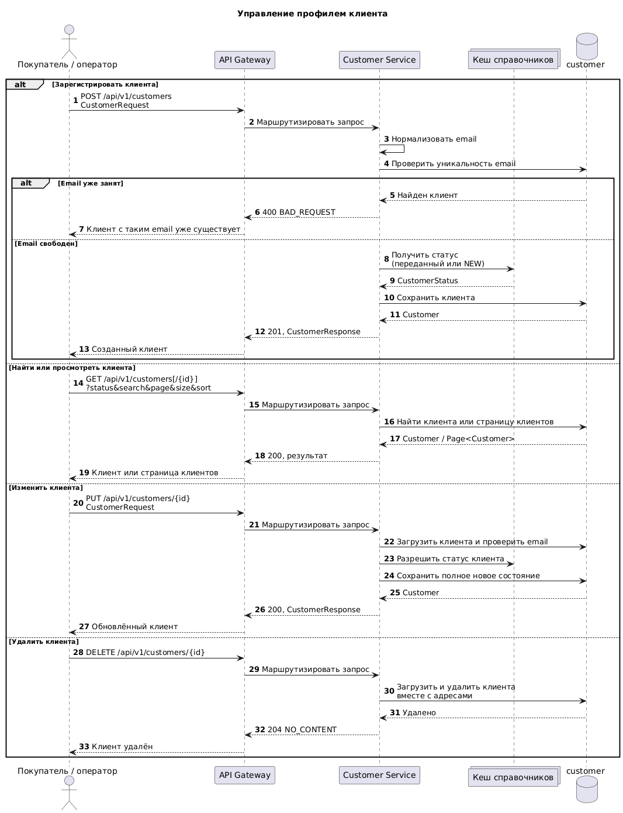

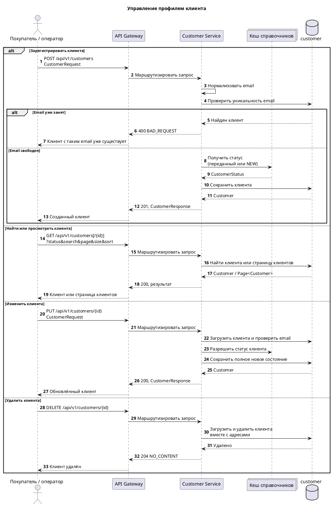
```plantuml
@startuml
title Управление профилем клиента
autonumber

actor "Покупатель / оператор" as User
participant "API Gateway" as Gateway
participant "Customer Service" as Customer
collections "Кеш справочников" as References
database "customer" as CustomerDb

alt Зарегистрировать клиента
    User -> Gateway: POST /api/v1/customers\nCustomerRequest
    Gateway -> Customer: Маршрутизировать запрос
    Customer -> Customer: Нормализовать email
    Customer -> CustomerDb: Проверить уникальность email
    alt Email уже занят
        CustomerDb --> Customer: Найден клиент
        Customer --> Gateway: 400 BAD_REQUEST
        Gateway --> User: Клиент с таким email уже существует
    else Email свободен
        Customer -> References: Получить статус\n(переданный или NEW)
        References --> Customer: CustomerStatus
        Customer -> CustomerDb: Сохранить клиента
        CustomerDb --> Customer: Customer
        Customer --> Gateway: 201, CustomerResponse
        Gateway --> User: Созданный клиент
    end
else Найти или просмотреть клиента
    User -> Gateway: GET /api/v1/customers[/{id}]\n?status&search&page&size&sort
    Gateway -> Customer: Маршрутизировать запрос
    Customer -> CustomerDb: Найти клиента или страницу клиентов
    CustomerDb --> Customer: Customer / Page<Customer>
    Customer --> Gateway: 200, результат
    Gateway --> User: Клиент или страница клиентов
else Изменить клиента
    User -> Gateway: PUT /api/v1/customers/{id}\nCustomerRequest
    Gateway -> Customer: Маршрутизировать запрос
    Customer -> CustomerDb: Загрузить клиента и проверить email
    Customer -> References: Разрешить статус клиента
    Customer -> CustomerDb: Сохранить полное новое состояние
    CustomerDb --> Customer: Customer
    Customer --> Gateway: 200, CustomerResponse
    Gateway --> User: Обновлённый клиент
else Удалить клиента
    User -> Gateway: DELETE /api/v1/customers/{id}
    Gateway -> Customer: Маршрутизировать запрос
    Customer -> CustomerDb: Загрузить и удалить клиента\nвместе с адресами
    CustomerDb --> Customer: Удалено
    Customer --> Gateway: 204 NO_CONTENT
    Gateway --> User: Клиент удалён
end
@enduml
```

## Управление адресами доставки

Первый адрес клиента автоматически становится основным. При выборе другого основного адреса флаг
снимается с предыдущего; после удаления основного адреса основным становится самый ранний из
оставшихся.

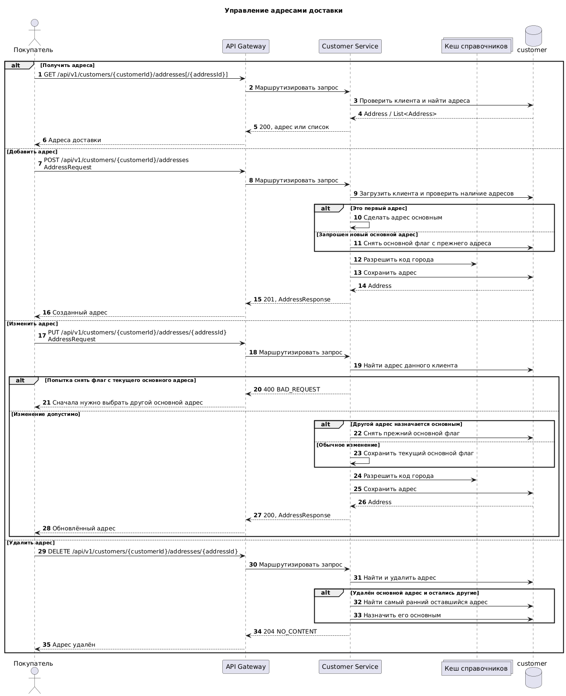

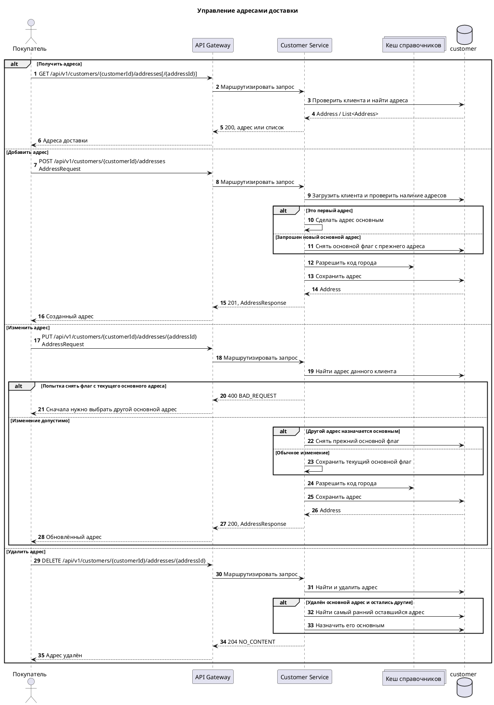
```plantuml
@startuml
title Управление адресами доставки
autonumber

actor "Покупатель" as Buyer
participant "API Gateway" as Gateway
participant "Customer Service" as Customer
collections "Кеш справочников" as References
database "customer" as CustomerDb

alt Получить адреса
    Buyer -> Gateway: GET /api/v1/customers/{customerId}/addresses[/{addressId}]
    Gateway -> Customer: Маршрутизировать запрос
    Customer -> CustomerDb: Проверить клиента и найти адреса
    CustomerDb --> Customer: Address / List<Address>
    Customer --> Gateway: 200, адрес или список
    Gateway --> Buyer: Адреса доставки
else Добавить адрес
    Buyer -> Gateway: POST /api/v1/customers/{customerId}/addresses\nAddressRequest
    Gateway -> Customer: Маршрутизировать запрос
    Customer -> CustomerDb: Загрузить клиента и проверить наличие адресов
    alt Это первый адрес
        Customer -> Customer: Сделать адрес основным
    else Запрошен новый основной адрес
        Customer -> CustomerDb: Снять основной флаг с прежнего адреса
    end
    Customer -> References: Разрешить код города
    Customer -> CustomerDb: Сохранить адрес
    CustomerDb --> Customer: Address
    Customer --> Gateway: 201, AddressResponse
    Gateway --> Buyer: Созданный адрес
else Изменить адрес
    Buyer -> Gateway: PUT /api/v1/customers/{customerId}/addresses/{addressId}\nAddressRequest
    Gateway -> Customer: Маршрутизировать запрос
    Customer -> CustomerDb: Найти адрес данного клиента
    alt Попытка снять флаг с текущего основного адреса
        Customer --> Gateway: 400 BAD_REQUEST
        Gateway --> Buyer: Сначала нужно выбрать другой основной адрес
    else Изменение допустимо
        alt Другой адрес назначается основным
            Customer -> CustomerDb: Снять прежний основной флаг
        else Обычное изменение
            Customer -> Customer: Сохранить текущий основной флаг
        end
        Customer -> References: Разрешить код города
        Customer -> CustomerDb: Сохранить адрес
        CustomerDb --> Customer: Address
        Customer --> Gateway: 200, AddressResponse
        Gateway --> Buyer: Обновлённый адрес
    end
else Удалить адрес
    Buyer -> Gateway: DELETE /api/v1/customers/{customerId}/addresses/{addressId}
    Gateway -> Customer: Маршрутизировать запрос
    Customer -> CustomerDb: Найти и удалить адрес
    alt Удалён основной адрес и остались другие
        Customer -> CustomerDb: Найти самый ранний оставшийся адрес
        Customer -> CustomerDb: Назначить его основным
    end
    Customer --> Gateway: 204 NO_CONTENT
    Gateway --> Buyer: Адрес удалён
end
@enduml
```

## Управление товарами

Оператор может создать товар или полностью заменить его данные. SKU уникален; категория, вид
животного и бренд должны существовать в справочниках. Удаление товара отдельным use case не
реализовано — товар можно вывести из продажи флагом `active`.

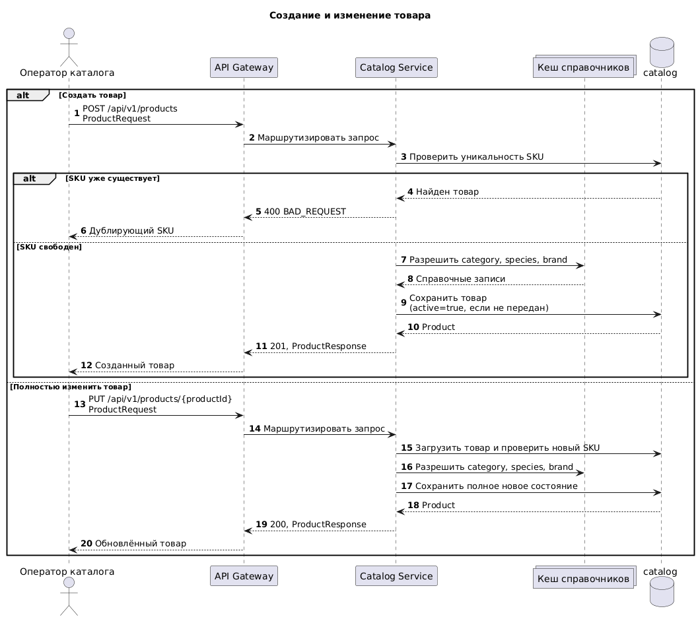

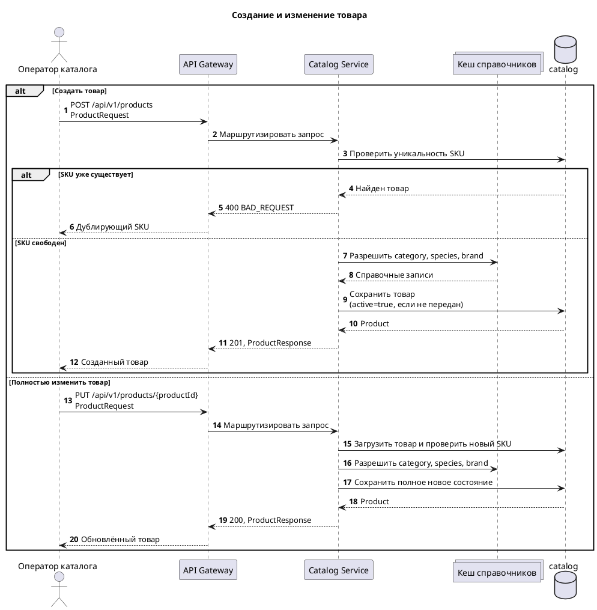
```plantuml
@startuml
title Создание и изменение товара
autonumber

actor "Оператор каталога" as Operator
participant "API Gateway" as Gateway
participant "Catalog Service" as Catalog
collections "Кеш справочников" as References
database "catalog" as CatalogDb

alt Создать товар
    Operator -> Gateway: POST /api/v1/products\nProductRequest
    Gateway -> Catalog: Маршрутизировать запрос
    Catalog -> CatalogDb: Проверить уникальность SKU
    alt SKU уже существует
        CatalogDb --> Catalog: Найден товар
        Catalog --> Gateway: 400 BAD_REQUEST
        Gateway --> Operator: Дублирующий SKU
    else SKU свободен
        Catalog -> References: Разрешить category, species, brand
        References --> Catalog: Справочные записи
        Catalog -> CatalogDb: Сохранить товар\n(active=true, если не передан)
        CatalogDb --> Catalog: Product
        Catalog --> Gateway: 201, ProductResponse
        Gateway --> Operator: Созданный товар
    end
else Полностью изменить товар
    Operator -> Gateway: PUT /api/v1/products/{productId}\nProductRequest
    Gateway -> Catalog: Маршрутизировать запрос
    Catalog -> CatalogDb: Загрузить товар и проверить новый SKU
    Catalog -> References: Разрешить category, species, brand
    Catalog -> CatalogDb: Сохранить полное новое состояние
    CatalogDb --> Catalog: Product
    Catalog --> Gateway: 200, ProductResponse
    Gateway --> Operator: Обновлённый товар
end
@enduml
```

## Управление складскими остатками

Остаток ведётся по `productId`. При установке количества сервис не позволяет сделать его меньше
уже зарезервированного значения.

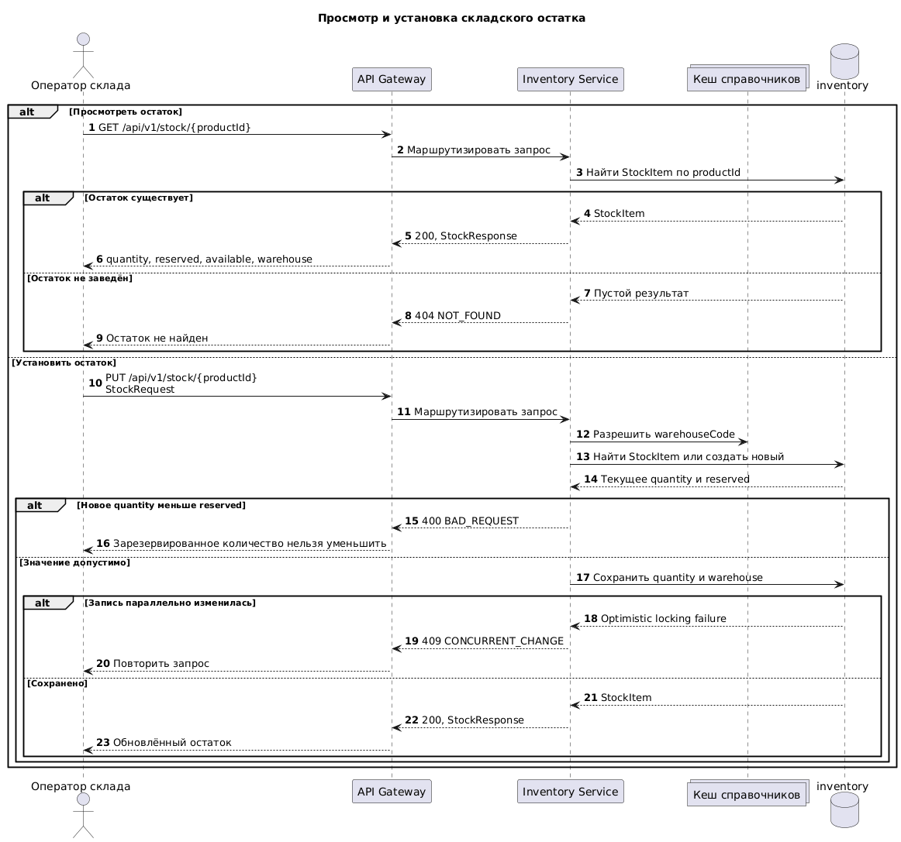

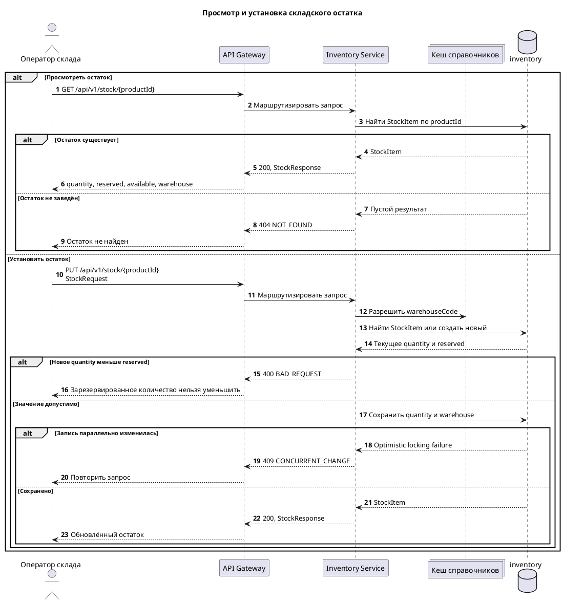
```plantuml
@startuml
title Просмотр и установка складского остатка
autonumber

actor "Оператор склада" as Operator
participant "API Gateway" as Gateway
participant "Inventory Service" as Inventory
collections "Кеш справочников" as References
database "inventory" as InventoryDb

alt Просмотреть остаток
    Operator -> Gateway: GET /api/v1/stock/{productId}
    Gateway -> Inventory: Маршрутизировать запрос
    Inventory -> InventoryDb: Найти StockItem по productId
    alt Остаток существует
        InventoryDb --> Inventory: StockItem
        Inventory --> Gateway: 200, StockResponse
        Gateway --> Operator: quantity, reserved, available, warehouse
    else Остаток не заведён
        InventoryDb --> Inventory: Пустой результат
        Inventory --> Gateway: 404 NOT_FOUND
        Gateway --> Operator: Остаток не найден
    end
else Установить остаток
    Operator -> Gateway: PUT /api/v1/stock/{productId}\nStockRequest
    Gateway -> Inventory: Маршрутизировать запрос
    Inventory -> References: Разрешить warehouseCode
    Inventory -> InventoryDb: Найти StockItem или создать новый
    InventoryDb --> Inventory: Текущее quantity и reserved
    alt Новое quantity меньше reserved
        Inventory --> Gateway: 400 BAD_REQUEST
        Gateway --> Operator: Зарезервированное количество нельзя уменьшить
    else Значение допустимо
        Inventory -> InventoryDb: Сохранить quantity и warehouse
        alt Запись параллельно изменилась
            InventoryDb --> Inventory: Optimistic locking failure
            Inventory --> Gateway: 409 CONCURRENT_CHANGE
            Gateway --> Operator: Повторить запрос
        else Сохранено
            InventoryDb --> Inventory: StockItem
            Inventory --> Gateway: 200, StockResponse
            Gateway --> Operator: Обновлённый остаток
        end
    end
end
@enduml
```

## Оформление заказа

При оформлении `order-service` параллельно получает товары из каталога и клиента с адресом
доставки. После проверок он резервирует остаток и только затем сохраняет заказ. Если сохранение
после резерва не удалось, выполняется компенсирующий `Release`.

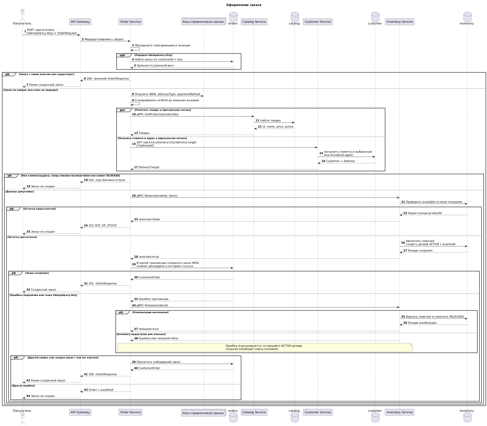

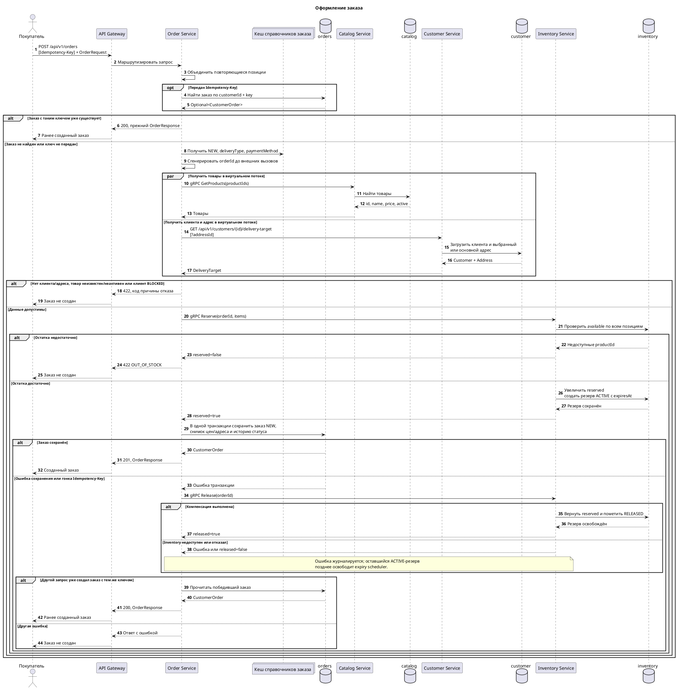
```plantuml
@startuml
title Оформление заказа
autonumber

actor "Покупатель" as Buyer
participant "API Gateway" as Gateway
participant "Order Service" as Order
collections "Кеш справочников заказа" as OrderReferences
database "orders" as OrderDb
participant "Catalog Service" as Catalog
database "catalog" as CatalogDb
participant "Customer Service" as Customer
database "customer" as CustomerDb
participant "Inventory Service" as Inventory
database "inventory" as InventoryDb

Buyer -> Gateway: POST /api/v1/orders\n[Idempotency-Key] + OrderRequest
Gateway -> Order: Маршрутизировать запрос
Order -> Order: Объединить повторяющиеся позиции

opt Передан Idempotency-Key
    Order -> OrderDb: Найти заказ по customerId + key
    OrderDb --> Order: Optional<CustomerOrder>
end

alt Заказ с таким ключом уже существует
    Order --> Gateway: 200, прежний OrderResponse
    Gateway --> Buyer: Ранее созданный заказ
else Заказ не найден или ключ не передан
    Order -> OrderReferences: Получить NEW, deliveryType, paymentMethod
    Order -> Order: Сгенерировать orderId до внешних вызовов

par Получить товары в виртуальном потоке
    Order -> Catalog: gRPC GetProducts(productIds)
    Catalog -> CatalogDb: Найти товары
    CatalogDb --> Catalog: id, name, price, active
    Catalog --> Order: Товары
else Получить клиента и адрес в виртуальном потоке
    Order -> Customer: GET /api/v1/customers/{id}/delivery-target\n[?addressId]
    Customer -> CustomerDb: Загрузить клиента и выбранный\nили основной адрес
    CustomerDb --> Customer: Customer + Address
    Customer --> Order: DeliveryTarget
end

alt Нет клиента/адреса, товар неизвестен/неактивен или клиент BLOCKED
    Order --> Gateway: 422, код причины отказа
    Gateway --> Buyer: Заказ не создан
else Данные допустимы
    Order -> Inventory: gRPC Reserve(orderId, items)
    Inventory -> InventoryDb: Проверить available по всем позициям
    alt Остатка недостаточно
        InventoryDb --> Inventory: Недоступные productId
        Inventory --> Order: reserved=false
        Order --> Gateway: 422 OUT_OF_STOCK
        Gateway --> Buyer: Заказ не создан
    else Остатка достаточно
        Inventory -> InventoryDb: Увеличить reserved\nсоздать резерв ACTIVE с expiresAt
        InventoryDb --> Inventory: Резерв сохранён
        Inventory --> Order: reserved=true

        Order -> OrderDb: В одной транзакции сохранить заказ NEW,\nснимок цен/адреса и историю статуса
        alt Заказ сохранён
            OrderDb --> Order: CustomerOrder
            Order --> Gateway: 201, OrderResponse
            Gateway --> Buyer: Созданный заказ
        else Ошибка сохранения или гонка Idempotency-Key
            OrderDb --> Order: Ошибка транзакции
            Order -> Inventory: gRPC Release(orderId)
            alt Компенсация выполнена
                Inventory -> InventoryDb: Вернуть reserved и пометить RELEASED
                InventoryDb --> Inventory: Резерв освобождён
                Inventory --> Order: released=true
            else Inventory недоступен или отказал
                Inventory --> Order: Ошибка или released=false
                note over Order, Inventory
                  Ошибка журналируется; оставшийся ACTIVE-резерв
                  позднее освободит expiry scheduler.
                end note
            end
            alt Другой запрос уже создал заказ с тем же ключом
                Order -> OrderDb: Прочитать победивший заказ
                OrderDb --> Order: CustomerOrder
                Order --> Gateway: 200, OrderResponse
                Gateway --> Buyer: Ранее созданный заказ
            else Другая ошибка
                Order --> Gateway: Ответ с ошибкой
                Gateway --> Buyer: Заказ не создан
            end
        end
    end
end
end
@enduml
```

## Просмотр заказов и истории статусов

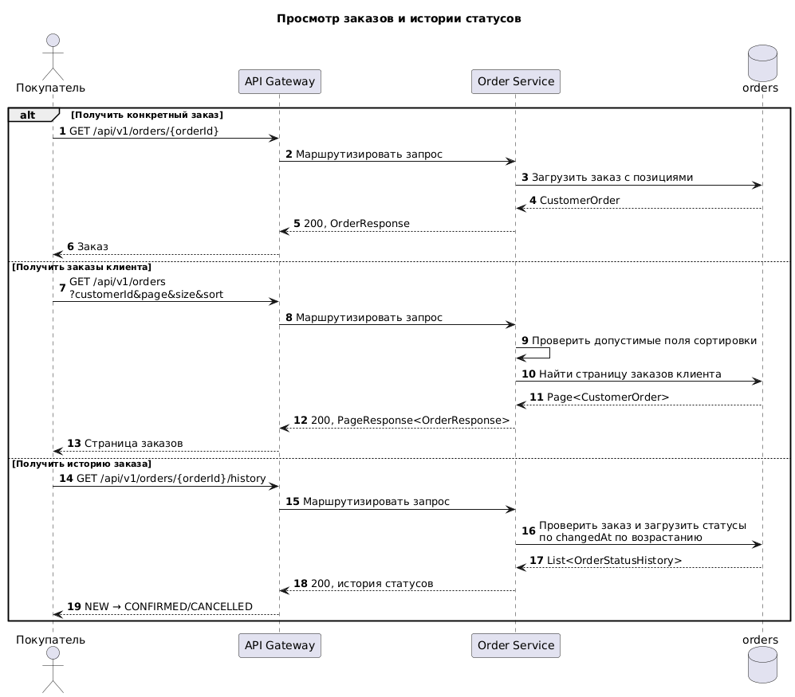

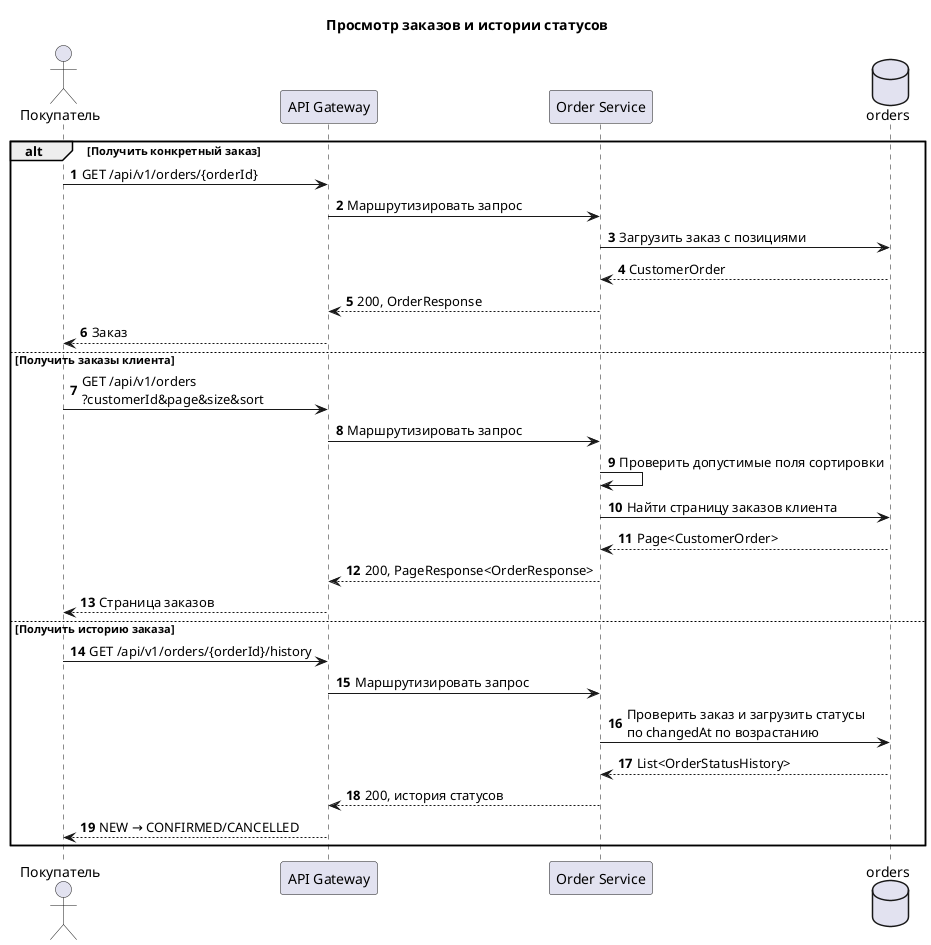
```plantuml
@startuml
title Просмотр заказов и истории статусов
autonumber

actor "Покупатель" as Buyer
participant "API Gateway" as Gateway
participant "Order Service" as Order
database "orders" as OrderDb

alt Получить конкретный заказ
    Buyer -> Gateway: GET /api/v1/orders/{orderId}
    Gateway -> Order: Маршрутизировать запрос
    Order -> OrderDb: Загрузить заказ с позициями
    OrderDb --> Order: CustomerOrder
    Order --> Gateway: 200, OrderResponse
    Gateway --> Buyer: Заказ
else Получить заказы клиента
    Buyer -> Gateway: GET /api/v1/orders\n?customerId&page&size&sort
    Gateway -> Order: Маршрутизировать запрос
    Order -> Order: Проверить допустимые поля сортировки
    Order -> OrderDb: Найти страницу заказов клиента
    OrderDb --> Order: Page<CustomerOrder>
    Order --> Gateway: 200, PageResponse<OrderResponse>
    Gateway --> Buyer: Страница заказов
else Получить историю заказа
    Buyer -> Gateway: GET /api/v1/orders/{orderId}/history
    Gateway -> Order: Маршрутизировать запрос
    Order -> OrderDb: Проверить заказ и загрузить статусы\nпо changedAt по возрастанию
    OrderDb --> Order: List<OrderStatusHistory>
    Order --> Gateway: 200, история статусов
    Gateway --> Buyer: NEW → CONFIRMED/CANCELLED
end
@enduml
```

## Подтверждение заказа и списание остатка

Подтверждение имитирует успешную оплату. Смена статуса, запись истории и событие outbox выполняются
в одной транзакции. Остаток списывается только после получения `ORDER_CONFIRMED` из Kafka.

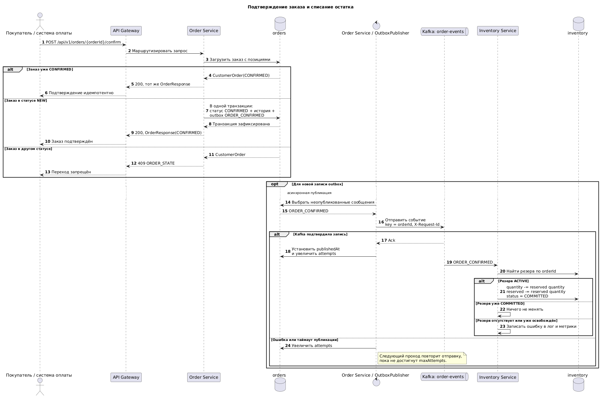

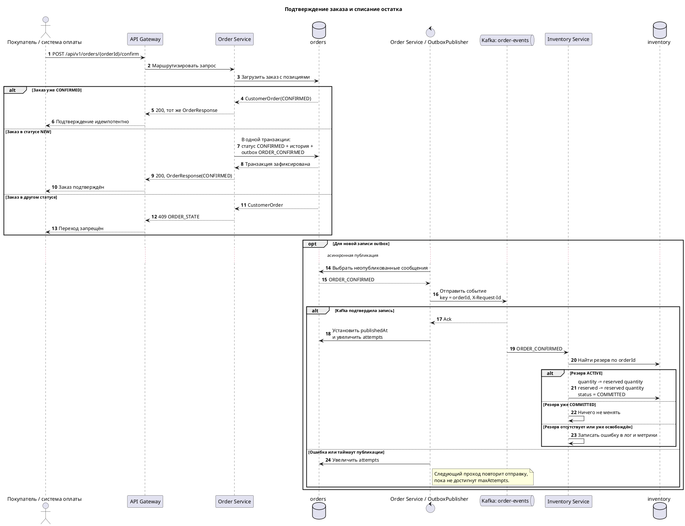
```plantuml
@startuml
title Подтверждение заказа и списание остатка
autonumber

actor "Покупатель / система оплаты" as Payer
participant "API Gateway" as Gateway
participant "Order Service" as Order
database "orders" as OrderDb
control "Order Service / OutboxPublisher" as Outbox
queue "Kafka: order-events" as Kafka
participant "Inventory Service" as Inventory
database "inventory" as InventoryDb

Payer -> Gateway: POST /api/v1/orders/{orderId}/confirm
Gateway -> Order: Маршрутизировать запрос
Order -> OrderDb: Загрузить заказ с позициями

alt Заказ уже CONFIRMED
    OrderDb --> Order: CustomerOrder(CONFIRMED)
    Order --> Gateway: 200, тот же OrderResponse
    Gateway --> Payer: Подтверждение идемпотентно
else Заказ в статусе NEW
    Order -> OrderDb: В одной транзакции:\nстатус CONFIRMED + история +\noutbox ORDER_CONFIRMED
    OrderDb --> Order: Транзакция зафиксирована
    Order --> Gateway: 200, OrderResponse(CONFIRMED)
    Gateway --> Payer: Заказ подтверждён
else Заказ в другом статусе
    OrderDb --> Order: CustomerOrder
    Order --> Gateway: 409 ORDER_STATE
    Gateway --> Payer: Переход запрещён
end

opt Для новой записи outbox
    ... асинхронная публикация ...
    Outbox -> OrderDb: Выбрать неопубликованные сообщения
    OrderDb --> Outbox: ORDER_CONFIRMED
    Outbox -> Kafka: Отправить событие\nkey = orderId, X-Request-Id
    alt Kafka подтвердила запись
        Kafka --> Outbox: Ack
        Outbox -> OrderDb: Установить publishedAt\nи увеличить attempts
        Kafka -> Inventory: ORDER_CONFIRMED
        Inventory -> InventoryDb: Найти резерв по orderId
        alt Резерв ACTIVE
            Inventory -> InventoryDb: quantity -= reserved quantity\nreserved -= reserved quantity\nstatus = COMMITTED
        else Резерв уже COMMITTED
            Inventory -> Inventory: Ничего не менять
        else Резерв отсутствует или уже освобождён
            Inventory -> Inventory: Записать ошибку в лог и метрики
        end
    else Ошибка или таймаут публикации
        Outbox -> OrderDb: Увеличить attempts
        note right of Outbox
          Следующий проход повторит отправку,
          пока не достигнут maxAttempts.
        end note
    end
end
@enduml
```

## Отмена заказа и освобождение резерва

Отменить можно только заказ `NEW`. Как и подтверждение, повторная отмена идемпотентна, а событие
доставляется через outbox.

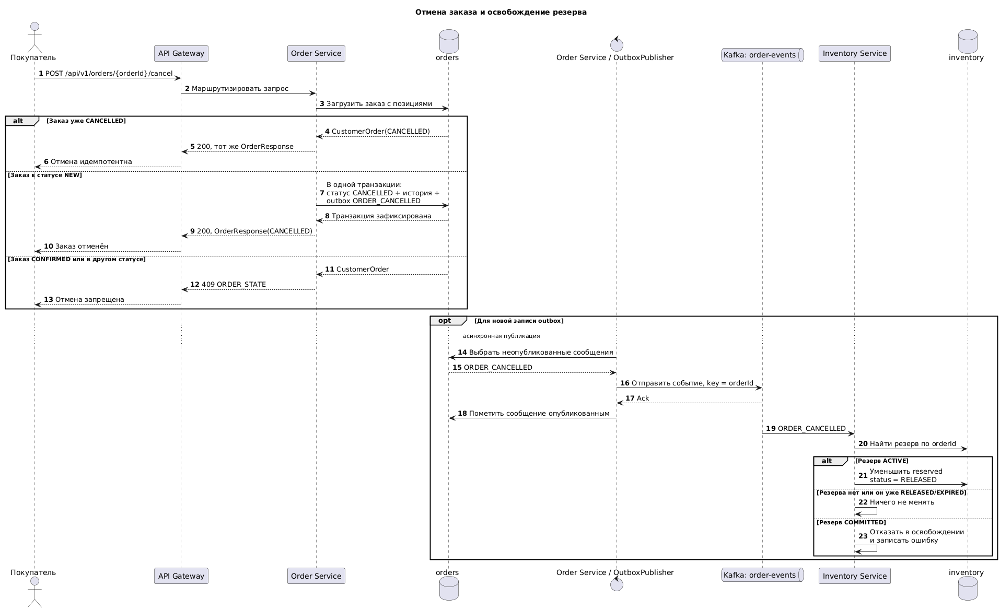

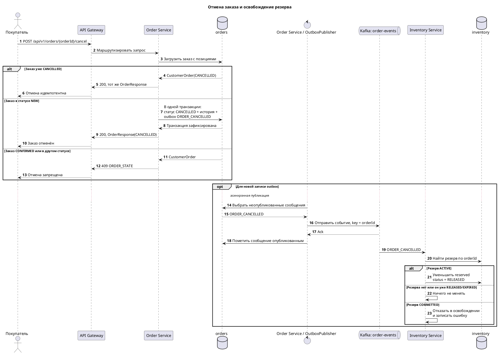
```plantuml
@startuml
title Отмена заказа и освобождение резерва
autonumber

actor "Покупатель" as Buyer
participant "API Gateway" as Gateway
participant "Order Service" as Order
database "orders" as OrderDb
control "Order Service / OutboxPublisher" as Outbox
queue "Kafka: order-events" as Kafka
participant "Inventory Service" as Inventory
database "inventory" as InventoryDb

Buyer -> Gateway: POST /api/v1/orders/{orderId}/cancel
Gateway -> Order: Маршрутизировать запрос
Order -> OrderDb: Загрузить заказ с позициями

alt Заказ уже CANCELLED
    OrderDb --> Order: CustomerOrder(CANCELLED)
    Order --> Gateway: 200, тот же OrderResponse
    Gateway --> Buyer: Отмена идемпотентна
else Заказ в статусе NEW
    Order -> OrderDb: В одной транзакции:\nстатус CANCELLED + история +\noutbox ORDER_CANCELLED
    OrderDb --> Order: Транзакция зафиксирована
    Order --> Gateway: 200, OrderResponse(CANCELLED)
    Gateway --> Buyer: Заказ отменён
else Заказ CONFIRMED или в другом статусе
    OrderDb --> Order: CustomerOrder
    Order --> Gateway: 409 ORDER_STATE
    Gateway --> Buyer: Отмена запрещена
end

opt Для новой записи outbox
    ... асинхронная публикация ...
    Outbox -> OrderDb: Выбрать неопубликованные сообщения
    OrderDb --> Outbox: ORDER_CANCELLED
    Outbox -> Kafka: Отправить событие, key = orderId
    Kafka --> Outbox: Ack
    Outbox -> OrderDb: Пометить сообщение опубликованным
    Kafka -> Inventory: ORDER_CANCELLED
    Inventory -> InventoryDb: Найти резерв по orderId

    alt Резерв ACTIVE
        Inventory -> InventoryDb: Уменьшить reserved\nstatus = RELEASED
    else Резерва нет или он уже RELEASED/EXPIRED
        Inventory -> Inventory: Ничего не менять
    else Резерв COMMITTED
        Inventory -> Inventory: Отказать в освобождении\nи записать ошибку
    end
end
@enduml
```

## Автоматическое освобождение просроченного резерва

Если заказ не подтвердили и резерв достиг `expiresAt`, планировщик `inventory-service` возвращает
остаток. ShedLock гарантирует, что один проход выполняется только одной репликой сервиса.

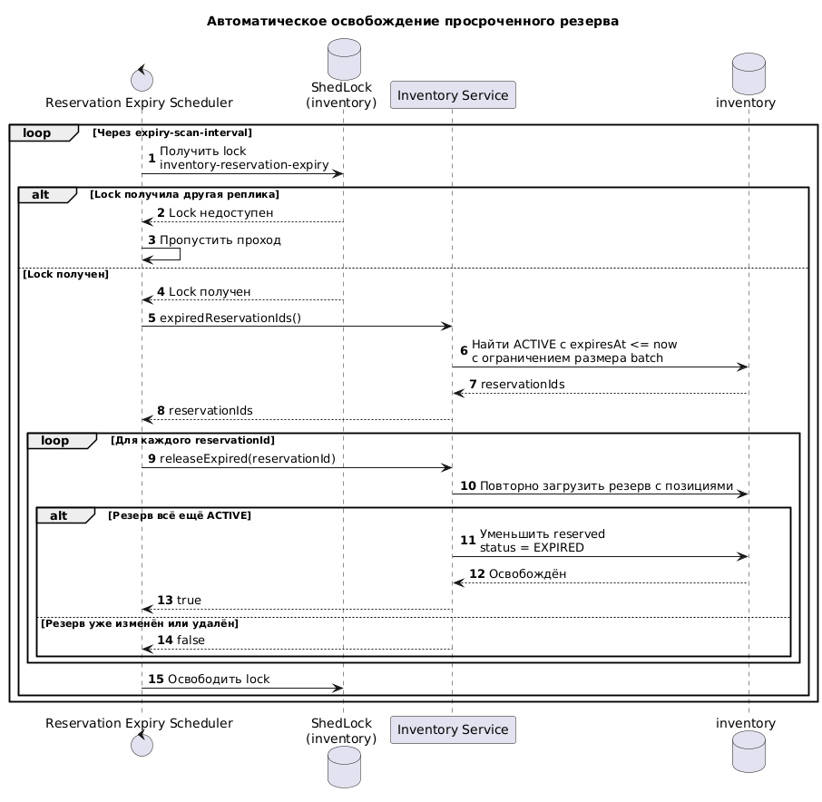

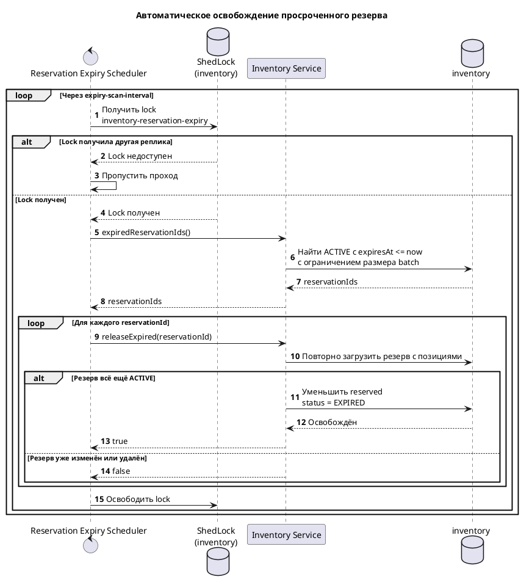
```plantuml
@startuml
title Автоматическое освобождение просроченного резерва
autonumber

control "Reservation Expiry Scheduler" as Scheduler
database "ShedLock\n(inventory)" as LockDb
participant "Inventory Service" as Inventory
database "inventory" as InventoryDb

loop Через expiry-scan-interval
    Scheduler -> LockDb: Получить lock\ninventory-reservation-expiry
    alt Lock получила другая реплика
        LockDb --> Scheduler: Lock недоступен
        Scheduler -> Scheduler: Пропустить проход
    else Lock получен
        LockDb --> Scheduler: Lock получен
        Scheduler -> Inventory: expiredReservationIds()
        Inventory -> InventoryDb: Найти ACTIVE с expiresAt <= now\nс ограничением размера batch
        InventoryDb --> Inventory: reservationIds
        Inventory --> Scheduler: reservationIds

        loop Для каждого reservationId
            Scheduler -> Inventory: releaseExpired(reservationId)
            Inventory -> InventoryDb: Повторно загрузить резерв с позициями
            alt Резерв всё ещё ACTIVE
                Inventory -> InventoryDb: Уменьшить reserved\nstatus = EXPIRED
                InventoryDb --> Inventory: Освобождён
                Inventory --> Scheduler: true
            else Резерв уже изменён или удалён
                Inventory --> Scheduler: false
            end
        end
        Scheduler -> LockDb: Освободить lock
    end
end
@enduml
```

## Чтение справочников

Справочники отдаются каждым предметным сервисом из локально прогретого кеша. Если кеш не прогрет,
readiness сервиса закрыта, а прямой запрос получает `503 SERVICE_UNAVAILABLE`.

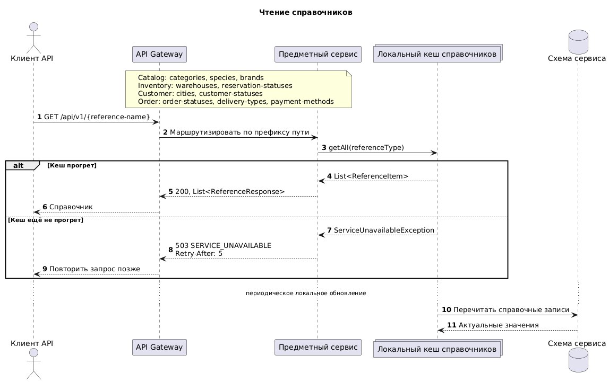

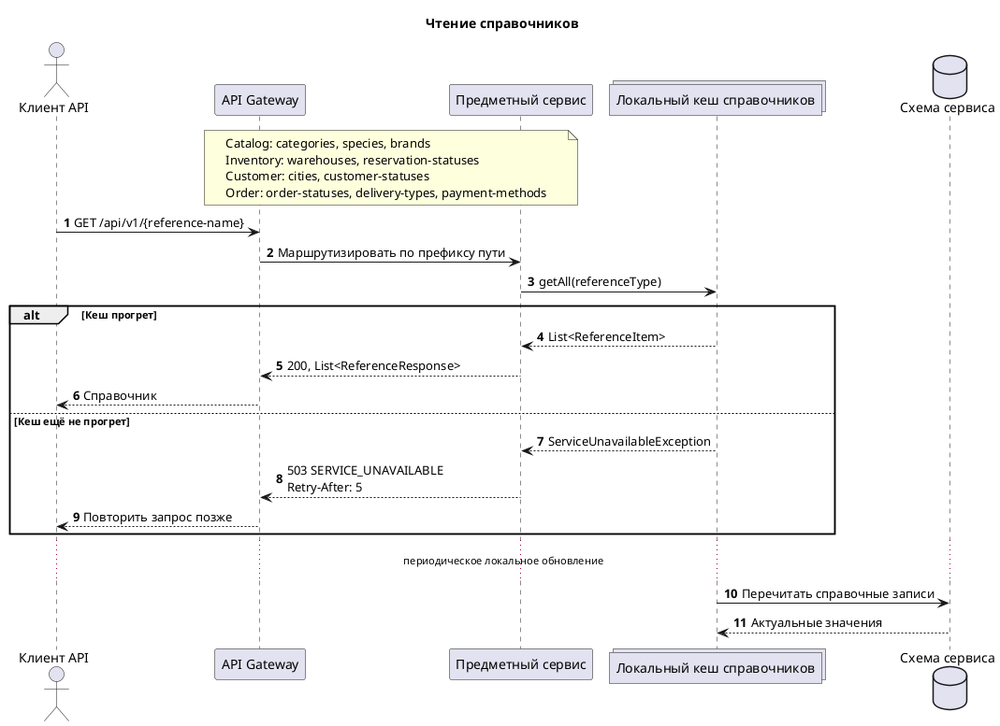
```plantuml
@startuml
title Чтение справочников
autonumber

actor "Клиент API" as Client
participant "API Gateway" as Gateway
participant "Предметный сервис" as Service
collections "Локальный кеш справочников" as References
database "Схема сервиса" as ServiceDb

note over Gateway, Service
  Catalog: categories, species, brands
  Inventory: warehouses, reservation-statuses
  Customer: cities, customer-statuses
  Order: order-statuses, delivery-types, payment-methods
end note

Client -> Gateway: GET /api/v1/{reference-name}
Gateway -> Service: Маршрутизировать по префиксу пути
Service -> References: getAll(referenceType)

alt Кеш прогрет
    References --> Service: List<ReferenceItem>
    Service --> Gateway: 200, List<ReferenceResponse>
    Gateway --> Client: Справочник
else Кеш ещё не прогрет
    References --> Service: ServiceUnavailableException
    Service --> Gateway: 503 SERVICE_UNAVAILABLE\nRetry-After: 5
    Gateway --> Client: Повторить запрос позже
end

... периодическое локальное обновление ...
References -> ServiceDb: Перечитать справочные записи
ServiceDb --> References: Актуальные значения
@enduml
```
